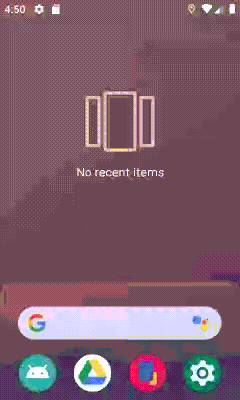
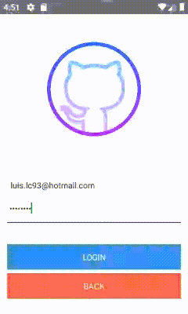
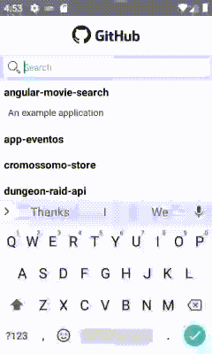
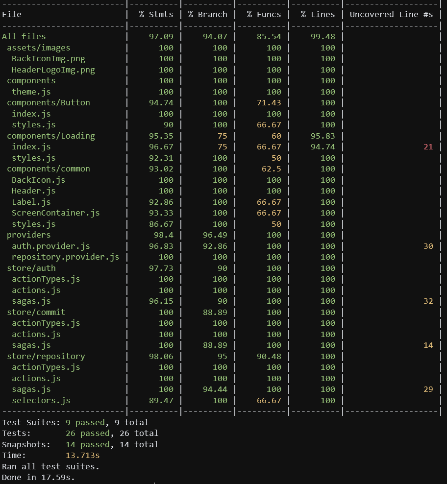

# GitHubSearch App

### Some screens :tada:

Main libraries used in this application

- **react-native**
- **styled-components** Used for styling
- **react-navigation** Navigation and screen containers
- **redux** Global store management
    - **redux-saga** 
    - **reselect**
- **axios** Requests for webservices
- **formik** Simplified forms
    - **yup** Functional form validation  

Main libraries used for testing

- **jest**
- **enzyme**
- **redux-saga-test-plan** Easy Saga tests 
- **react-test-renderer**

## Getting started 

install all dependencies running:

`yarn` or `npm install`

then run the start script:

`npx react-native run-android`  
or just  
`react-native run-android` (for this one you will need to have `react-native` client installed)

## Running Tests

As simple as just running:

`yarn test` or `npm run test`

Our current test coverage:

